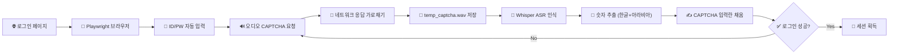
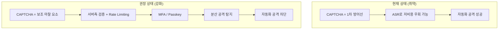
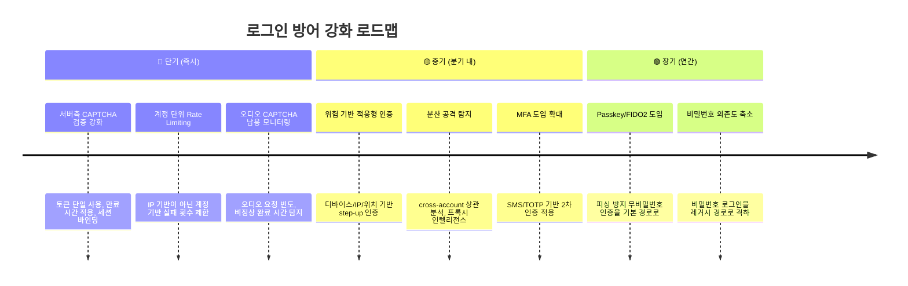

# 🔒 오디오 CAPTCHA 자동화 보안 평가 보고서

> **문서 분류:** 내부 보안 검토용 (Internal Use Only)
> **작성일:** 2026-03-26
> **상태:** PoC 완료 · 정량 검증 미완
> **참고 자료:** [`deep-research-report-4.md`](../research/deep-research-report-4.md)
> **대상 정보 별첨:** [`TARGET_DETAILS.md`](TARGET_DETAILS.md)

---

## Executive Summary

오디오 CAPTCHA는 **방어 수단이 아니라 마찰 요소**입니다.

이번 PoC는 대상 로그인 페이지의 오디오 CAPTCHA를 Playwright + 로컬 Whisper만으로 우회하고 자동 로그인에 성공했습니다. 유료 솔버 서비스나 외부 API 없이, **오픈소스 도구만으로 end-to-end 공격 파이프라인을 구현**할 수 있음을 입증했습니다.

이 결과는 외부 리서치가 반복적으로 경고하는 아래 사실과 정확히 일치합니다.

| 외부 리서치 결론 | 이번 PoC 검증 결과 |
|---|---|
| 오디오 CAPTCHA는 ASR 기반 자동화에 **구조적으로 취약** | ✅ 로컬 Whisper `tiny` 모델만으로 숫자 인식 성공 |
| CAPTCHA bypass는 **저비용 상용 생태계**로 성숙 | ✅ 상용 솔버 없이도 무료 로컬 스택으로 동일 접근 가능 |
| CAPTCHA는 **보조 마찰 수단**으로만 취급해야 함 | ✅ 1차 방어선으로 신뢰 불가 확인 |

> [!IMPORTANT]
> **핵심 판단:** CAPTCHA를 인증의 핵심 통제로 간주하고 있다면, 그 방어 체계는 이미 구조적으로 취약한 상태입니다.

---

## 1. 프로젝트 배경과 목적

### 왜 이 PoC를 수행했는가

외부 리서치(`../research/deep-research-report-4.md`)를 통해 CAPTCHA bypass 생태계의 성숙도를 확인했습니다. 그러나 "시장에 솔버가 존재한다"는 것과 "우리 서비스가 실제로 뚫린다"는 것은 다른 문제입니다.

**이 PoC의 목적은 리서치를 코드 수준에서 검증하는 것**이었습니다.

### 범위와 제약

| 항목 | 포함 여부 |
|---|:---:|
| 오디오 CAPTCHA 획득 및 ASR 인식 | ✅ |
| 브라우저 자동화를 통한 E2E 로그인 | ✅ |
| 화면 녹화 및 증거 수집 | ✅ |
| 크로스 플랫폼(Windows/macOS) 지원 | ✅ |
| 반복 성공률 정량 측정 | ❌ |
| 프록시/분산 인프라/브라우저 위장 | ❌ |
| 실계정 자격 증명 포함 | ❌ |

---

## 2. 공격 파이프라인 아키텍처

### 데이터 플로우



### 모듈 구성

| 파일 | 역할 | 핵심 로직 |
|---|---|---|
| `scripts/login.js` | **메인 자동화 스크립트** | CAPTCHA iframe 조작, 오디오 응답 가로채기, Whisper 호출, 재시도 루프 (최대 5회) |
| `scripts/login-agent.js` | **page-agent 하이브리드 스크립트** | Alibaba page-agent로 DOM 탐색 후 Playwright로 조작. 셀렉터를 모르는 페이지에도 적용 가능 |
| `scripts/runtime-tools.js` | **환경 추상화 계층** | OS별 FFmpeg/Whisper 탐색, PATH 구성, 한글 숫자 변환(`extractDigits`), 화면 녹화 명령 생성 |
| `scripts/record-all.js` | **증거 수집 래퍼** | FFmpeg 백그라운드 녹화 + `scripts/login.js` 동기 실행 |
| `scripts/test-whisper.js` | **환경 진단 도구** | Whisper/FFmpeg 설치 상태 점검 |

---

## 3. 외부 리서치 매핑

### 이 PoC가 속하는 공격 범주

외부 리서치의 기법 분류(Technique Taxonomy)에 따르면, 이 PoC는 아래 두 가지 범주에 정확히 대응합니다.

#### A. 오디오 접근성 남용 + ASR (Audio Abuse + ASR)

> *"unCaptcha 프로젝트는 reCAPTCHA 오디오 챌린지에 대해 85.15% 정확도, ~5.42초 처리 시간을 보고했으며, 다른 연구에서는 기성 음성 인식 서비스를 사용해 최대 98.3% 정확도를 달성했다."*
> — deep-research-report-4.md

이 PoC는 상용 ASR API도 아닌 **오프라인 Whisper `tiny` 모델**만으로 대상 서비스의 숫자 기반 오디오 CAPTCHA를 성공적으로 인식했습니다. 이는 오디오 CAPTCHA가 방어 수단으로서 가지는 근본적 한계를 직접 보여줍니다.

#### B. 브라우저 자동화 + 세션 조작 (Browser Automation)

이 PoC는 단순히 "CAPTCHA 문제를 풀었느냐"가 아닙니다. **실제 브라우저 세션 안에서의 완전한 공격 체인**입니다.

- ✅ 브라우저 세션 유지
- ✅ iframe 크로스 도메인 구조 탐색
- ✅ 네트워크 응답 직접 인터셉트
- ✅ 폼 제출 → 인증 성공까지 연결

### 상용 솔버 시장과의 비교

| 서비스 | 모델 | 오디오 CAPTCHA 가격 |
|---|---|---|
| 2Captcha | 인간 솔버 마켓플레이스 | **$0.50 / 1,000건** |
| Death By Captcha | 하이브리드 (AI+인간) | **$0.59 / 1,000건** |
| **이 PoC** | **로컬 Whisper (무료)** | **$0 (하드웨어 비용만)** |

> [!WARNING]
> 상용 솔버 시장이 이미 건당 $0.001 이하의 가격으로 오디오 CAPTCHA를 처리하고 있으며, 이 PoC는 그보다 더 낮은 비용(무료)으로 동일한 결과를 달성할 수 있음을 보여줍니다.

---

## 4. 실행 증거

### 검증 환경

| 항목 | 값 |
|---|---|
| OS | macOS (ARM64) |
| Node.js | v20.19.3 |
| Python | 3.11.4 |
| FFmpeg | 7.1.1 |
| Whisper | CLI (openai-whisper) |
| 모델 | `tiny.pt` |

### 실행 로그 (2026-03-26)

```
--- Whisper Environment Test ---
Whisper Command: whisper CLI
FFmpeg Command: ffmpeg
FFmpeg identified: ffmpeg version 7.1.1

--- Login Attempt 1/5 ---
[Info] Audio captured (83426 bytes).
[Info] Running Whisper via whisper CLI...
[00:00.000 --> 00:02.660]  7, 2, 2, 3, 0
[Success] Identified digits: 72230
[Done] Login successful
[Success] Full video saved as: login-demo.webm
```

### 확보된 증거 자료

| 파일 | 설명 |
|---|---|
| `login-page.png` | 로그인 페이지 스크린샷 |
| `login-page-debug.png` | DOM 디버깅용 스크린샷 |
| `login-demo.webm` | Playwright 브라우저 녹화 (로그인 성공 과정) |
| `full-session.mp4` | 전체 화면 녹화 (터미널 + 브라우저) |

---

## 5. 공격 파이프라인의 취약 지점

이 PoC가 "항상 성공하는 도구"는 아닙니다. 현재 구현이 의존하는 가정과 그 취약점을 명시합니다.

| 취약 지점 | 설명 | 깨지는 조건 |
|---|---|---|
| **DOM 셀렉터 결합** | `#loginname`, `#passwd`, `iframe#captcha`, `.btnSound` 등에 하드코딩 | UI 리팩터링 시 즉시 실패 |
| **오디오 응답 식별 휴리스틱** | URL에 `audio` 포함 + content-type에 `audio` 포함 조건으로 필터링 | 엔드포인트 변경, 암호화된 스트리밍 전환 시 실패 |
| **숫자 기반 CAPTCHA 가정** | 인식된 텍스트에서 `extractDigits()`로 아라비아 숫자 + 한글 숫자(영·일·이…구) 추출. Whisper가 한글로 출력해도 매핑 처리 | 문구(phrase) 기반 CAPTCHA로 전환 시 즉시 무의미화 |
| **최소 길이 검증** | 5자리 이상 추출 시에만 제출 시도 | CAPTCHA 길이 변경 시 false negative 증가 |
| **로컬 의존성** | Whisper CLI + FFmpeg + Python + 모델 파일 필수 | 환경 미구성 시 런타임 에러 |

> [!NOTE]
> Google은 **unCaptcha** 공개 후 reCAPTCHA 오디오를 숫자에서 문구(phrases)로 전환한 바 있습니다. 대상 서비스에서도 동일한 대응 시 이 PoC는 즉시 무력화됩니다.

---

## 6. 방어 관점 시사점

### CAPTCHA가 방어선이 되지 못하는 이유



### 권장 방어 로드맵



#### 단기 권장 조치 상세

| 조치 | 근거 | 참고 기준 |
|---|---|---|
| **서버측 CAPTCHA 토큰 검증 필수화** | 클라이언트측 위젯만으로는 보호 불가. 토큰 위조/재사용 방지 필수 | Cloudflare Turnstile 문서, Google reCAPTCHA 검증 문서 |
| **계정 단위 실패 제한** | IP 기반 제한은 프록시 로테이션으로 무력화됨 | NIST SP 800-63B-4 (인증 실패 횟수 제한 의무화) |
| **오디오 CAPTCHA 발급 제한** | 접근성을 해치지 않으면서 세션당 오디오 요청 횟수 제한 | OWASP Credential Stuffing Prevention |

---

## 7. 미완료 항목과 후속 과제

### 정량 검증이 필요한 영역

| 항목 | 현재 상태 | 필요 작업 |
|---|---|---|
| 반복 성공률 | 미측정 | N회 시도 → 성공/실패/실패유형 통계 |
| 실패 분류 체계 | 미정의 | 오디오 미검출 / ASR 오인식 / 형식 불일치 / DOM 에러 분류 |
| CAPTCHA 형식 내성 | 미검증 | 길이 변화, 언어 변화, 노이즈 레벨 변화에 대한 내성 테스트 |
| 페이지 구조 변경 복원력 | 미검증 | DOM 변경 시나리오별 자동 복구 가능성 |
| 운영 환경 장기 안정성 | 미검증 | 장기 실행 시 메모리/프로세스 누수, 세션 만료 처리 |

### 코드베이스 정리 필요 항목

- [x] `package.json`의 미사용 `openai` 의존성 제거 (완료)
- [x] 한글 숫자 매핑 (`extractDigits`) 구현 (완료)
- [x] Docker 기반 로컬 테스트 환경 구축 (완료: `test-site/`, `docker-compose.yml`)
- [x] Alibaba page-agent 통합 (`login-agent.js`) (완료)
- [x] reCAPTCHA v2 테스트 모드 지원 (완료)
- [ ] `WORKLOG.md` 최신 코드 기준으로 업데이트
- [ ] Linux 화면 녹화 지원 추가 (현재 Windows/macOS만)
- [ ] 자동화된 테스트 스위트 구현
- [ ] 실험 결과 저장 포맷 정의
- [x] `package.json`의 `"name": "ocb"` → `"captcha-bypass"`로 변경

---

## 8. 최종 평가

### 이 PoC가 입증한 것

> **오디오 CAPTCHA는 방어의 핵심이 될 수 없다.**

이 저장소는 프록시 풀, 분산 인프라, 고급 브라우저 위장, 토큰 재사용 공격 등 고도화된 상용 bypass 모델을 구현하지 않았습니다. 그럼에도 **Playwright + 로컬 Whisper + 네트워크 응답 가로채기**라는 단순한 조합만으로 E2E 로그인 성공을 달성했습니다.

방어 측에 대한 시사점은 명확합니다.

1. **CAPTCHA는 보조 마찰 수단으로만 취급**하고
2. **서버측 검증, 계정 단위 차단, MFA/Passkey**를 주된 방어선으로 구축해야 합니다

### 다음 단계의 핵심
새로운 우회 기능을 추가하는 것이 아니라, **현재 구현을 기준으로 성공률과 실패 조건을 정량화**하고, **방어 측 권고안을 내부 통제 체계의 언어로 번역하는 것**입니다.

---

*Last Updated: 2026-03-30*
